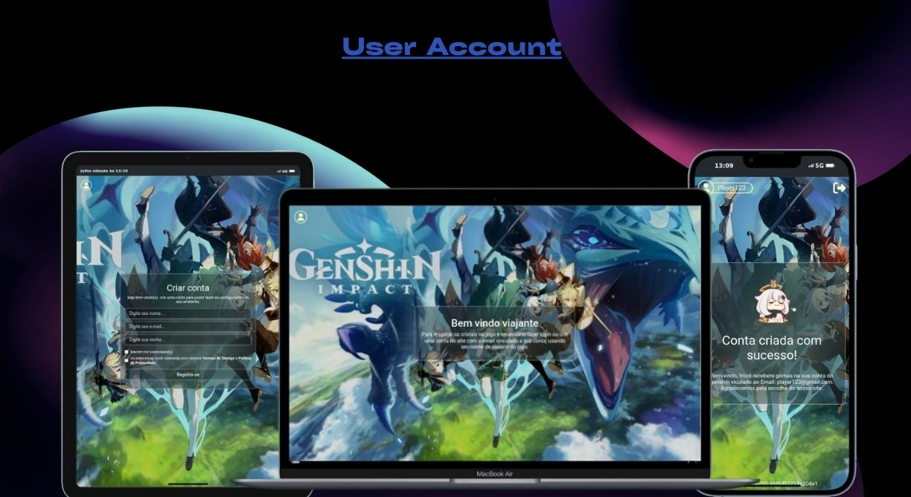

<h1 align='center' >
  💻User Account
</h1>
<div align='center'>

[Descrição](#descrição)
|
[Iniciar](#iniciar)
|
[Licença](#licença)

</div>

<div align='center'>
  
</div>

<div align='center'>
  
</div>

## Descrição

Uma aplicação de login e registro de usuários, usando jwt para proporcionar auto login de forma rapida e segura.

Teve como objetivo, testar minhas habilidades em:

- jwt(json web token)
- aprimorar minhas habilidades em com: sass, webpack

As principais características do site:

- login E registro de conta.
- auto login usando jwt, como autenticação
- logout da conta registrada

Se quiser ver o projeto em mais detalhes clique **[User Account](https://user-account-beta.vercel.app/)**

## Iniciar

E necessário o **[Node.js](https://nodejs.org/pt/download)** instalado na máquina e o back-end da aplicação acesse **[User Account API](https://github.com/matheus369k/user-account-api.git)**.

Para iniciar o projeto, basta clonar o repositório e instalar as dependências.

```bash
git clone https://github.com/matheus369k/user-account
cd user-account
npm install
```

E nesse criar um aquivo env com o nome .env e adicionar as seguintes variáveis de ambiente:

```bash
BACK_END_URL=http://localhost:3000
```

Para iniciar o projeto, basta executar o comando:

```bash
npm run dev
```

## Licença

Fora usado a licença [MIT](./LICENSE).
